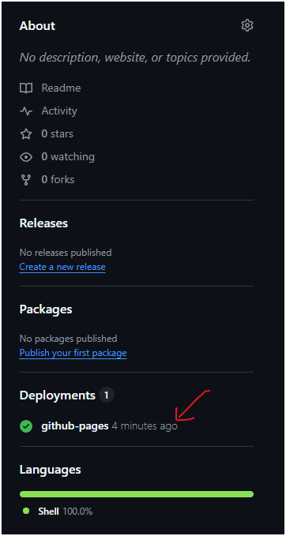

# Minimal Notes Template

> **Template repository:** [https://github.com/alexusgracia/manuals](https://github.com/alexusgracia/manuals)

This template allows you to create course notes using Sphinx, Markdown, and Read the Docs in the simplest way possible.

## Structure

- `requirements.txt`: required dependencies
- `.gitignore`: ignores automatically generated files
- `docs/`: folder with the documentation in Markdown
  - `template.md`: template for new topics
- `images/`: folder for images
- `build.sh`: a script to automate the compilation
  
## Which files should you edit?

- **docs/index.md**: This is the main index of the documentation. Here you can add the cover, introduction, and the list of topics or chapters.
- **docs/topic1.md, docs/topic2.md, ...**: Create or edit these files for each topic, chapter, or section of the course. You can add as many Markdown files as you need, linking them from the index.
- **docs/conf.py**: (Optional) Only if you want to change the project title, author, or some advanced Sphinx configuration.

The rest of the files usually do not need to be modified to create your notes.

## How to build the documentation locally

1. **Clone the repository:**

   ```bash
   git clone https://github.com/youruser/yourrepo.git
   cd manuals
   ```

2. **Create a virtual environment (optional but recommended):**

   ```bash
   python -m venv venv
   source venv/bin/activate  # On Windows: venv\Scripts\activate
   ```

3. **Install dependencies:**

   ```bash
   pip install -r requirements.txt
   ```

4. **Build the documentation:**
   You can use either of the following options:
   - Run the command directly:

     ```bash
     sphinx-build -b html docs docs/_build/html
     ```

   - Or use the provided script (on Unix/Linux/Mac):

     ```bash
     ./build.sh
     ```

     (If needed, make it executable first: `chmod +x build.sh`)
5. **View the documentation locally:**
   - Open the file `docs/_build/html/index.html` in your web browser.
   - You can usually double-click the file or right-click and choose "Open with" and select your browser.
   - Alternatively, you can enter the file path in your browser's address bar (e.g., `file:///C:/path/to/manuals/docs/_build/html/index.html` on Windows).

## Markdown Examples

### Image

```markdown

```

### Table

```markdown
| Concept   | Description        |
|-----------|-------------------|
| Markdown  | Simple syntax     |
| Sphinx    | Docs generator    |
```

### Code

```python
print("Hello, world!")
```

### Math equations (LaTeX)

You can write inline equations: `$E=mc^2$` or block equations:

```markdown
$$
\int_0^1 x^2 dx = \frac{1}{3}
$$
```

### Quotes and links

```markdown
> "Education is the most powerful weapon which you can use to change the world." — Nelson Mandela

[Markdown Guide](https://www.markdownguide.org/basic-syntax/)
```

## Customize the Sphinx theme

To change the appearance, edit the `html_theme` variable in `docs/conf.py`. For example:

```python
html_theme = 'alabaster'
```

See the [Sphinx themes documentation](https://www.sphinx-doc.org/en/master/usage/theming.html) for more options.

## Automatic deployment on GitHub Pages

1. Push all files to the `main` branch of your GitHub repository.
2. Go to the **Actions** tab in your repository and make sure the "Deploy Sphinx docs to GitHub Pages" workflow runs successfully.
3. Go to **Settings** > **Pages** in your repository.
4. In the **Build and deployment** section, select **GitHub Actions** as the source. (later we'll change this)
5. Once the workflow is complete, your documentation will be available at the URL provided by GitHub Pages (usually `https://<user>.github.io/<repo>/`).

## Where will your documentation be published?

After a successful deployment, your documentation will be available at a URL like:

```
https://<username>.github.io/<repository>/
```

For example, if your GitHub username is `alexusgracia` and your repository is `manuals`, the documentation will be published at:

```
https://alexusgracia.github.io/manuals/
```

**Note:** It may take a few minutes after each deployment for the site to become available or for changes to appear. If you see a 404 error, wait a bit and refresh the page.

## Important note about workflow permissions

To ensure automatic deployment to GitHub Pages works correctly, you must enable **workflow permissions**:

1. Go to your repository on GitHub.
2. Navigate to **Settings** > **Actions** > **General**.
3. Find the **Workflow permissions** section.
4. Select **Read and write permissions**.
5. Click **Save**.

This allows GitHub Actions to have permission to push to the `gh-pages` branch and deploy your documentation.

## About the `gh-pages` branch

When you deploy the documentation using GitHub Actions, a new branch called `gh-pages` will be created automatically in your repository (if it does not already exist). This branch will contain the compiled HTML files generated by Sphinx.

GitHub Pages will use the content of the `gh-pages` branch to publish your documentation site. You should not edit this branch manually; all changes will be managed by the deployment workflow.

## Configuring GitHub Pages settings

After the first commit, you need to configure GitHub Pages to use the correct branch and folder:

1. Go to your repository on GitHub.
2. Navigate to **Settings** > **Pages**.
3. In the **Source** section, select **Deploy from a branch**.
4. Choose the branch `gh-pages` and the folder `/ (root)`.
5. Click **Save**.

**Note:** Sometimes, after the very first commit or deploy, the `gh-pages` branch or the option to select it may not appear immediately. If this happens, wait a few minutes and refresh the page until the option becomes available.

Once configured, GitHub Pages will serve your documentation from the compiled files in the `gh-pages` branch.




If everything works correctly, you should see an image similar to the one above in the **Actions** section of your repository, indicating that the deployment workflow has run successfully. If you see the green check mark and the success message, it means the documentation has been deployed correctly and will be available on GitHub Pages as explained above.

## Improvements

If you have suggestions, corrections, or improvements for this project, feel free to open an issue or submit a pull request. I will be happy to add any modifications and improvements contributed by the community to make this repository even more useful for everyone.

This template was created at CITCEA, which is a research group at UPC (Universitat Politècnica de Catalunya). If you have any questions or suggestions, feel free to contact me at alexandre.gracia[at]upc.edu

